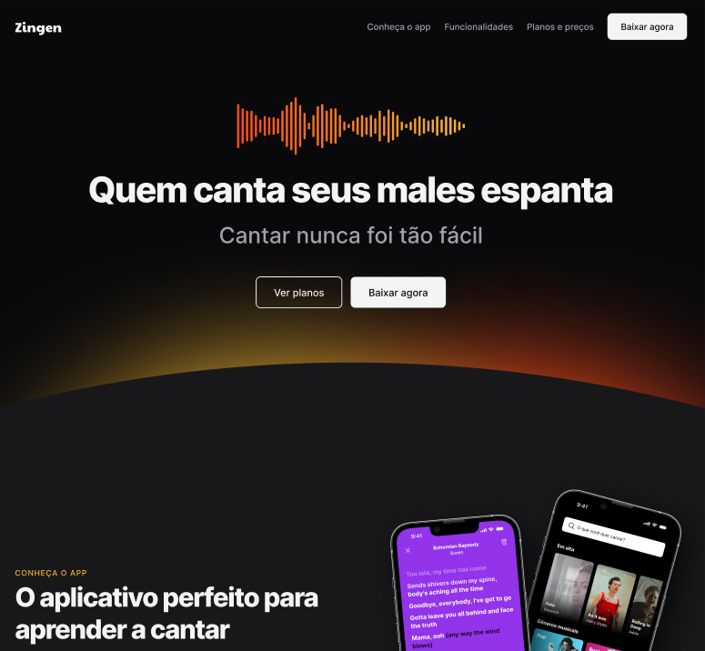

  <a href="#-tecnologias">Tecnologias</a>&nbsp;&nbsp;&nbsp;|&nbsp;&nbsp;&nbsp;
  <a href="#-projeto">Projeto</a>&nbsp;&nbsp;&nbsp;|&nbsp;&nbsp;&nbsp;

 

  

## 🚀 Tecnologias

Esse projeto foi desenvolvido com as seguintes tecnologias:

- HTML
- CSS

Bibliotecas

- [Google Fonts](https://fonts.google.com/)

## 💻 Projeto

Zingen é uma página institucional no formato One Page, responsiva, para usar em diversos tipos de micro, pequena e média empresas. Contém as seguintes seções: Header, Hero, Ferramentas, Sobre e Footer

## link
https://zingen-karaoke-one.vercel.app/